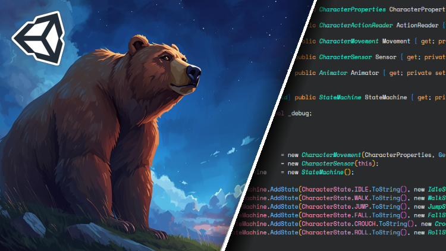

# Game Dev Essentials - State Machines in Unity

## Course Description

Welcome to **Game Dev Essentials - State Machines in Unity**! This comprehensive Udemy course dives deep into the world of state machines and how to implement them effectively in Unity game development. Whether you're a beginner looking to understand the fundamentals or an experienced developer wanting to refine your skills, this course will equip you with the knowledge to create robust, maintainable game logic using state machines.

## What You'll Learn

- Understanding the concept of state machines and their importance in game development
- Implementing finite state machines (FSM) in Unity using C#
- Advanced state machine patterns and architectures
- Real-world examples with practical Unity projects
- Best practices for organizing and maintaining state-based code
- Integration with Unity's component system and event handling
- Debugging and optimizing state machine implementations

## Prerequisites

- Basic knowledge of Unity and C# programming
- Familiarity with Unity's interface and basic scripting
- No prior experience with state machines required

## Course Structure

This repository contains the accompanying Unity project files for the course. Each module includes:

- Complete Unity scenes demonstrating state machine concepts
- Reusable scripts and components
- Example implementations for common game mechanics
- Documentation and comments explaining the code

### Modules Included:

1. **Introduction to State Machines** - Core concepts and theory
2. **Basic FSM Implementation** - Simple state machine examples
3. **Advanced Patterns** - Hierarchical and concurrent state machines
4. **Unity Integration** - Working with Unity's lifecycle and events
5. **Real-World Examples** - Complete game mechanics using state machines
6. **Best Practices** - Code organization and optimization

## Getting Started

1. Clone or download this repository
2. Open the project in Unity (recommended version: 2021.3 or later)
3. Navigate through the scenes in the Assets folder to explore different examples
4. Follow along with the course videos for detailed explanations

## Requirements

- Unity 2021.3 or later
- Basic understanding of C# and Unity scripting

## License

This project is for educational purposes as part of the Udemy course "Game Dev Essentials - State Machines in Unity". Please respect the course content and licensing terms.

---

*Happy coding! 🎮*
